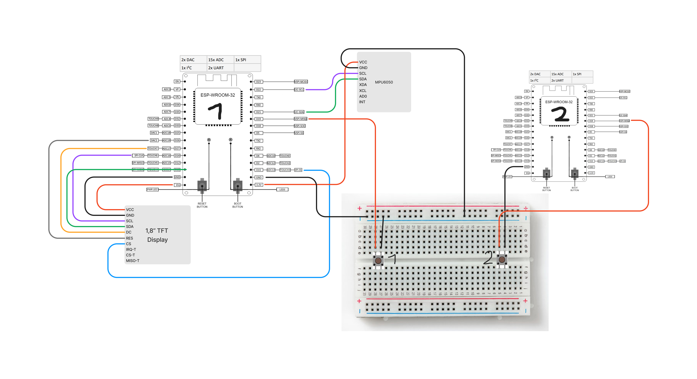
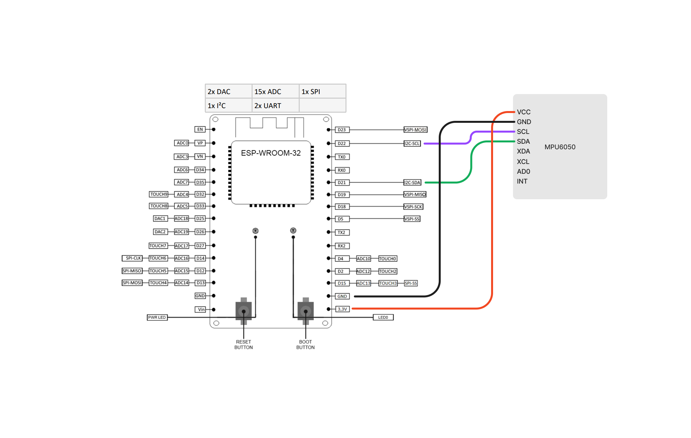
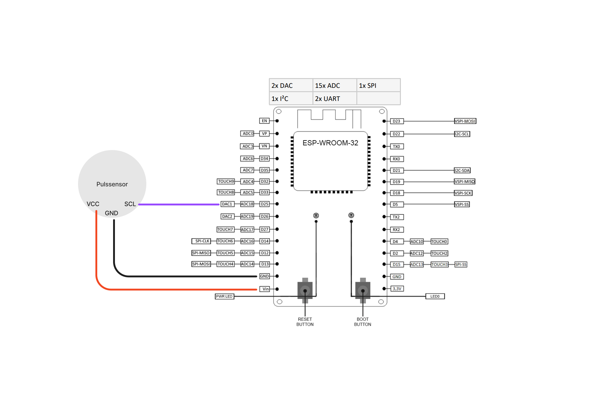

# Buddy, ein Semesterprojekt von Kim Karn

## Was ist Buddy?

Buddy begleitet und unterstützt Personen in ihrem Alltag und fördert ihre Motivation und die Freunde an körperlicher Aktivität. Er besteht aus zwei Teilen: dem Wearable und dem Würfel. Mit dem Wearable werden körperliche Daten (Schritte und Puls) getrackt, die auf einem Display angezeigt werden. Der namensgebende Motivationsbuddy ist bei jeder Aktivität mit dabei und sendet den Nutzenden Erinnerungen und kleine Prompts. Außerdem kann man sich mit dem Wearable mit anderen Personen vernetzen. Mit dem Würfel können die Nutzenden sich jede Woche neue Aktivitäten auswürfeln. Die gesammelten Daten des Wearables sind ebenfalls auf einer Seite des Würfels zu sehen.

<hr>

## Was ist das Ziel von Buddy?

Ziel ist es Personen nach einer Reha bei der Aufrechterhaltung ihrer Motivation vor allem in Bezug auf die körperliche Aktivität zu unterstützen. Dadurch können die positiven Effekte einer Reha und die Gesundheit der Nutzenden langfristig aufrechterhalten werden. Dieses Ziel soll durch Monitoring, Erinnerungen, Vernetzung mit anderen Personen und Hilfe bei dem Aufbauen einer Routine gelingen.

<hr>

## Was wurde umgesetzt?

Aufgrund der eingeschränkten Ressourcen konnte das Konzept nicht mit den erforderlichen Komponenten umgesetzt werden. Die wichtigsten Funktionen wurden jedoch beispielhaft im Rahmen des MVP bewiesen. Das beinhaltet die Kommunikation zwischen zwei Wearables, die Erfassung der körperlichen Daten, die Übertragung der Daten und die Funktionalität des Würfels.

<hr>

### Übersicht

**P4_SS23_Server.ino** <br>
Der ESP32 fungiert als Server. Sobald der Client einen http.GET request macht, antwortet der Server. Die Antwort erfolgt mithilfe eines Knopfes. Außerdem werden die Schritte über einen Beschleunigungssensor ausgelesen und auf einem Display angezeigt. <br>

**P4_SS23_Client.ino** <br>
Der ESP32 fungiert als Client. Sobald der Knopf gedrückt wurde, wird immer wieder ein http.GET an den Server gesendet. Diese und die Server Datei sollen die Kommunkation zwischen zwei Wearables verdeutlichen.<br>

**P4_SS23_Pulssensor.ino** <br>
Ein Pulssensor wird an einen ESP 32 angeschlossen. Die Daten (bpm) werden im Seriellen Monitor ausgegeben. <br>

**P4_SS23_Wuerfel.ino** <br>
Über einen ESP23 wird ein Webserver gestartet auf dem die Schrittdaten von dem Beschleunigungssensor angezeigt werden. Das soll die Datenübertragung zwischen Wearable und Würfel verdeutlichen.
Die Funktionalität des Würfels kann man zudem über folgende Website testen: https://activity-roll.onrender.com/ <br>

<hr>

### Liste der Bauteile

- 2x DEBO JT ESP32 NodeMCU ESP32 WiFi- und Bluetooth-Modul

- 1x DEBO TFT 1.8 TD Entwicklerboards - Display, 1,8", Touch, ST7735R

- 1x DEBO SENS 3AXISH Entwicklerboards - Beschleunigung & Gyroskop, mit Header, MPU-60

- 1x ARD SEN HEART Arduino - Puls-/Herzschlag-Sensor

- 2x
  Tastschalter

- 2x USB zu mircoUSB Kabel
- 14x Buchse/Buchse Jumper Wire
- 5x Buchse/Stecker Jumper Wire
- 1x Stecker/Stecker Jumper Wire

...und ein Breadboard.

<hr>

### Inbetriebnahme

ESP32 Board Manager in die Arduino IDE hinzufügen: https://raw.githubusercontent.com/espressif/arduino-esp32/gh-pages/package_esp32_index.json

<br>

Schaltplan für **P4_SS23_Server.ino und P4_SS23_Client.ino**


1. Die Bauteile (2x ESP32,1x TFT Display, 1x MPU5060 Beschleunigungssensor) dem Schaltplan entsprechend anschließen.

2. ESP32 1 und ESP32 2 per USB an den Computer anschließen.

3. Die Dateien P4_SS23_Server.ino und P4_SS23_Client.ino über die Arduino IDE öffnen.

4. Die benötigen Bibliotheken in der Arduino IDE runter laden.

```
P4_SS23_Server.ino
#include <WiFi.h>
#include <WiFiClient.h>
#include <ESPAsyncWebServer.h>
#include <Wire.h>
#include <MPU6050.h>
#include <TFT_eSPI.h>

P4_SS23_Client.ino
#include <WiFi.h>
#include <HTTPClient.h>
```

5. Die WLAN-Anmeldedaten in beiden Dateien editieren.

```
const char* ssid = "SSID";
const char* password = "Password";
```

6. Die editierten Dateien auf die beiden ESP32 laden. P4_SS23_Server.ino auf ESP32 1 und P4_SS23_Client.ino auf ESP32 2.

7. Den Seriellen Monitor bei beiden öffnen.

8. Sobald man mit dem WLAN verbunden ist, den Button 2 betätigen, um einen http.GET request zu senden.

9. Über den Button 1 kann eine Antwort auf den Request gesendet werden. Über die Seriellen Monitore kann der Status verfolgt werden

10. Den Beschleunigungssensor in die Hand nehmen und bewegen.

11. Die aufgezeichneten Schritte werden im Seriellen Monitor und auf dem Display angezeigt.

<br>

Schaltplan für **P4_SS23_Wuerfel.ino**


1. Die Bauteile (ESP32 und MPU5060 Beschleunigungssensor) dem Schaltplan entsprechend anschließen.

2. ESP32 per USB an den Computer anschließen.

3. Die Datei P4_SS23_Wuerfel.ino über die Arduino IDE öffnen.

4. Die WLAN-Anmeldedaten in der Datei editieren.

```
const char* ssid = "SSID";
const char* password = "Password";
```

5. Die benötigen Bibliotheken in der Arduino IDE runter laden.

```
#include <WiFi.h>
#include <Wire.h>
#include <MPU6050.h>
```

5. Die editierten Dateien auf den ESP32 laden.

6. Den Seriellen Monitor öffnen.

7. Sobald man mit dem WLAN verbunden ist, die Adresse des Webservers kopieren (steht in Seriellen Monitor).

8. Die Adresse des Webservers im Webbrowser anzeigen.

9. Den Beschleunigungssensor in die Hand nehmen und bewegen.

10. Die aufgezeichneten Schritte werden im Seriellen Monitor und im Webbrowser durch den Webserver angezeigt.

<br>

Schaltplan für **P4_SS23_Pulssensor.ino**


1. Die Bauteile (ESP32 und Pulssensor) dem Schaltplan entsprechend anschließen.

2. ESP32 per USB an den Computer anschließen.

3. Die Datei P4_SS23_Pulssensor.ino über die Arduino IDE öffnen.

4. Die benötigte Bibliothek in der Arduino IDE runter laden.

```
#include <PulseSensorPlayground.h>
```

5. Die Datei auf den ESP32 laden.

6. Den Seriellen Monitor öffnen.

7. Den Pulssensor zwischen zwei Fingern halten.

8. Im Seriellen Monitor werden die BPM angezeigt. (Leider ist der Pulssenor defekt, weswegen es nicht richtig funktioniert.)

### Verwendete Tutorials

https://randomnerdtutorials.com/getting-started-with-esp32/
https://esp32io.com/tutorials/esp32-button
https://aliakbarfani.wordpress.com/part-2-setting-up-pulse-sensor-with-esp32-and-arduino-ide/
https://randomnerdtutorials.com/esp32-mpu-6050-accelerometer-gyroscope-arduino/

Hinweis: ChatGPT hat beim Bug Fixing geholfen.

```
Buddy

Hochschule Darmstadt - Sommersemester 23 - Fachsemester 4
Ein Semesterprojekt von Kim Karn
```
